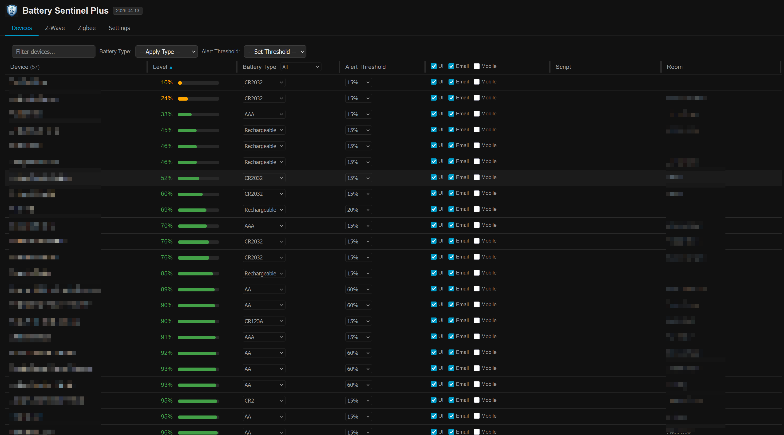
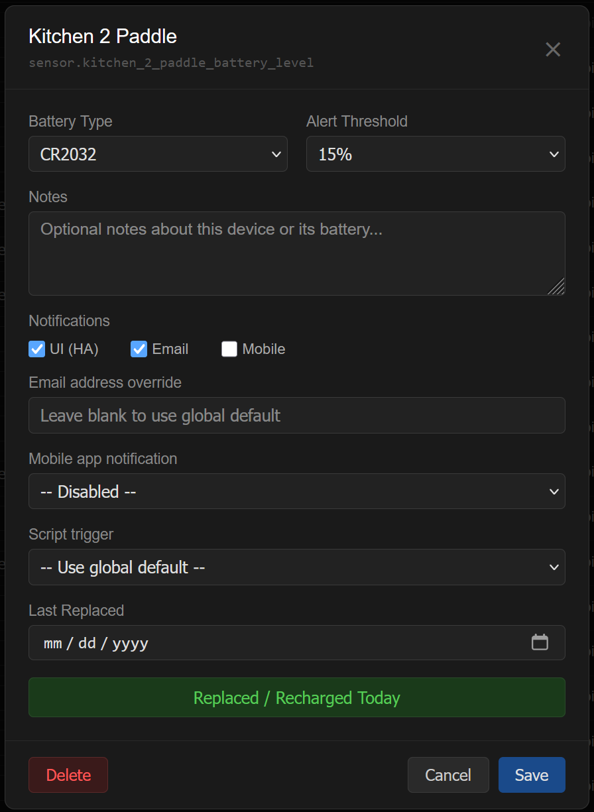
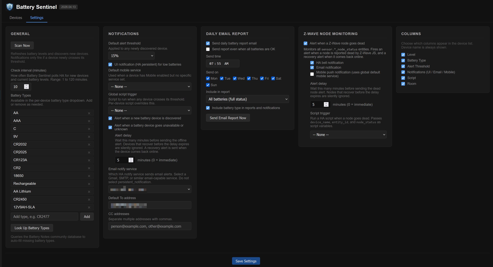
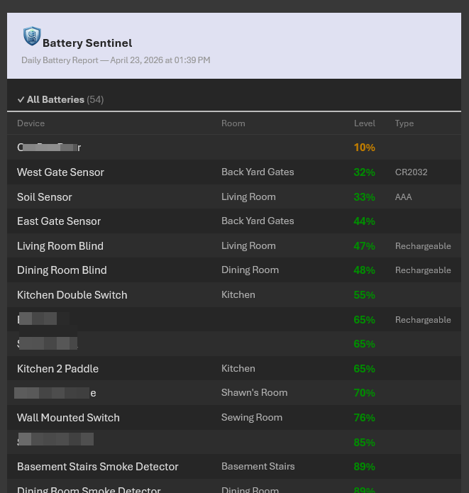
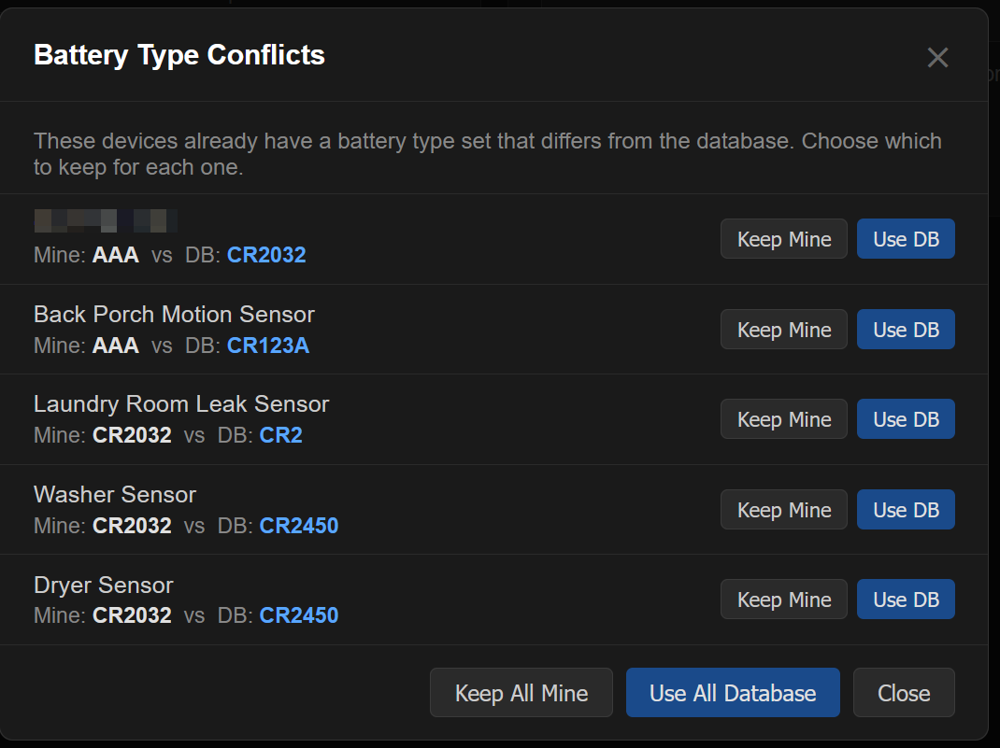

# Battery Sentinel - Home Assistant App / Add-on

Dead batteries break automations. Battery Sentinel finds every battery-powered device in Home Assistant, alerts you before they die, and gives you a proper management page to track them all.

**Z-Wave users:** Battery Sentinel now monitors your entire Z-Wave network for dead nodes, not just battery levels. Any Z-Wave device -- switches, dimmers, sensors, sirens, locks -- is covered, including mains-powered devices that have no battery entity at all. Battery Sentinel watches the node status sensor reported by Z-Wave JS and alerts you when a node goes offline, so you know about a problem before an automation fails.

[](https://github.com/smcneece/battery-sentinel/releases)
[](LICENSE)

> ⚠️ **Supervisor Required**: Battery Sentinel is a Home Assistant **add-on** and requires a Supervisor-managed installation. It will **not** work on Home Assistant Core (Python package) or Home Assistant Container (Docker-only). If you are running **Home Assistant OS** or **Home Assistant Supervised**, you're good to go.

> [](https://github.com/sponsors/smcneece) If Battery Sentinel saves you from dead Z-Wave sensors, drained Zigbee devices, or a phone or tablet that's quietly hitting 10% in the background, consider sponsoring! Even a small one-time amount shows appreciation. Check out my [other HA projects](https://github.com/smcneece?tab=repositories) while you're here.
>
> ⭐ **Finding this useful?** Star the repo so other HA users can find it!
> [](https://github.com/smcneece/battery-sentinel/stargazers)

---

## Screenshots











---

## Features

### Device Discovery and Display
- Auto-discovers all battery-powered devices from Home Assistant; no manual configuration required
- Handles both numeric sensors (percentage) and binary sensors (Low/OK)
- Color-coded battery level indicators: red below 10%, amber below 25%, green otherwise
- Room/area column sourced from the HA area registry
- Sortable columns: name, level, or room
- Resizable columns with widths saved across browser sessions
- Inline alert threshold and battery type selectors per row, no need to open the device panel
- Live filter box above the device list; type any part of a device name to narrow the list instantly
- Battery Type column header filter: show only devices with a specific type, or find all unassigned devices at a glance
- Column visibility controls in Settings: show or hide any column (Level, Battery Type, Alert Threshold, Notifications, Script, Room)

### Bulk Edit
- **Battery Type toolbar**: pick a type from the dropdown and apply it to all text-filtered devices at once; useful for tagging a whole category (e.g., all smoke detectors) in one step
- **Alert Threshold toolbar**: same bulk-set pattern for thresholds; filter by name, pick a threshold, apply to all matching devices with one confirmation

### Per-device Management
Click any device in the list to open its detail panel.

- **Inline rename**: click the device name at the top of the panel to edit it; saving writes the new friendly name back to Home Assistant via the entity registry (entity ID is unchanged, so automations and dashboards are unaffected). Note: this renames the battery *entity* only, not the parent device; the device name in HA's device registry is separate and will not change
- Manufacturer and model number shown below the entity ID (pulled from the HA device registry; blank if the device has no registry entry)
- Battery type dropdown (AA, AAA, C, 9V, CR2032, CR2025, CR123A, CR2, 18650, or custom)
- Per-device alert threshold (5% to 60% in 5% increments, or Ignore)
- Notes field for free-text information about the device or its battery
- Last replaced date, manually editable or stamped with the Replaced/Recharged Today button
- Per-device notification controls: UI, Email, and Mobile toggles; email address override; mobile app service selector
- **Mute notifications**: silence alerts for a device for 1 hour, 3 hours, 8 hours, 1 day, 3 days, or 1 week; a bell icon appears in the device list next to muted devices; mutes expire automatically with no cleanup needed
- Hide device: removes it from the list and suppresses all alerts; hidden devices are accessible in a collapsible section at the bottom of the Devices tab where they can be restored or permanently deleted. Note: if the entity still exists in Home Assistant, permanently deleted devices will reappear on the next scan.

### Notifications
Battery Sentinel supports three notification channels, each configurable globally and per device.

- **UI notification**: a single consolidated HA persistent notification listing all currently low batteries, sorted lowest first; updates in place each check cycle and dismisses automatically when all batteries recover
- **Email**: fires once per device when its threshold is first crossed; resets when the battery recovers
- **Mobile push**: per-device push notification via any `mobile_app_*` notify service; a global default service can be set in Settings with a per-device override in the device panel
- Each device has individual UI / Email / Mobile toggles in the device list and in the device panel; column header checkboxes let you enable or disable a channel for all devices at once
- Configurable check interval (default 10 minutes)
- Optional alert when a new battery device is discovered
- Optional alert when a battery device goes unavailable or unknown (useful for Z-Wave/Zigbee devices that stop reporting after firmware updates or radio changes); configurable delay (default 5 minutes) filters out brief communication blips before firing; a matching recovery notification is sent when the device comes back online

### Email
- Select any HA notify service from a dropdown (populated from your installed integrations)
- Global To address and CC field (comma-separated for multiple recipients)
- Per-device email address override
- HTML-formatted email body for proper line breaks in all email clients

### Daily Report
- Scheduled daily email report at a configurable time
- HTML-formatted email with a header (Battery Sentinel icon + date/time stamp), color-coded battery levels (red/amber/green), and a footer link to the project
- Full-list mode splits into two sections: **Needs Attention** (below threshold) and **All Batteries** (above threshold), each sorted lowest battery first
- Low-only mode sends only the devices below their threshold, sorted lowest first; suppressed automatically when nothing is low (configurable)
- Optional battery type column in each row
- **Send Report Now** button in Settings sends the report immediately without waiting for the scheduled time; useful for testing your email setup

### Script Triggers
Run any Home Assistant script when a device crosses its threshold; useful for Alexa announcements, SMS notifications, flashing lights, or any other automation.

- **Global script**: set once in Settings; runs for every device that has no per-device override
- **Per-device script**: overrides the global for that device; can also be set to *Disabled* to suppress the global for a specific device
- Rate-limited to **once per calendar day** per device; if a battery sits at the threshold and fluctuates up and down, the script fires only once that day
- The Script column in the device list shows the assigned script at a glance (device-specific in white, inherited global in gray, disabled shows "Off")

Battery Sentinel passes the following variables to the script automatically:

| Variable | Example value | Description |
|----------|--------------|-------------|
| `device_name` | `Back Porch Temp Sensor` | Friendly name of the device |
| `battery_level` | `8%` or `Low` | Current battery level |
| `battery_type` | `AA` | Battery type if set, otherwise blank |
| `area` | `Outside` | HA area/room if assigned |
| `entity_id` | `sensor.back_porch_battery` | HA entity ID |

**Example script**: Alexa announcement with a fallback SMS:

```yaml
alias: Battery Sentinel Low Battery Alert
sequence:
  - action: notify.alexa_media_kitchen
    data:
      message: >
        Attention: {{ device_name }} battery is low at {{ battery_level }}.
        It uses {{ battery_type }} batteries.
      data:
        type: announce
  - action: notify.sms_gateway
    data:
      message: >
        Battery Sentinel: {{ device_name }} ({{ area }}) is at {{ battery_level }}.
        Battery type: {{ battery_type }}.
        Entity: {{ entity_id }}
```

### Z-Wave Node Monitoring

Battery Sentinel monitors Z-Wave network health by watching the node status sensors created by Z-Wave JS. When Z-Wave JS marks a node dead, Battery Sentinel picks it up on the next scan and fires an alert. How quickly Z-Wave JS declares a node dead depends on the device type and network activity -- mains-powered devices are typically flagged within several minutes once Z-Wave JS attempts to contact them, while battery-powered sleeping devices may take longer since Z-Wave JS waits for their scheduled wakeup window.

This covers your entire Z-Wave network, not just battery-powered devices. Mains-powered switches, dimmers, outlets, locks, sirens -- anything with a `sensor.*_node_status` entity in Z-Wave JS is monitored. Without this feature, the only way to know a node is dead is to notice an automation failed or manually check the Z-Wave device list.

- Monitors all `sensor.*_node_status` entities created by Z-Wave JS automatically; covers every Z-Wave device on your network regardless of whether it has a battery sensor
- Fires a dead node alert (bell and/or email) after a configurable delay; brief communication blips that resolve before the delay expires are silently ignored
- Fires a recovery notification when a dead node comes back online
- Alert fires once per dead event and resets automatically on recovery; no repeat notifications while a node stays dead
- Suppressed on the first scan after add-on startup so a rebooting HA instance does not flood you with alerts while Z-Wave JS is still initialising
- Separate bell, email, and mobile push toggles in the Z-Wave Node Monitoring settings card
- Optional script trigger when a node goes dead; passes `device_name`, `entity_id`, and `node_status` as variables

> Future: dead Z-Wave nodes may appear directly in the device list so they can be muted or acknowledged the same way battery devices are.

### Battery Type Lookup
Battery Sentinel can automatically identify battery types for your devices using the [Battery Notes](https://github.com/andrew-codechimp/HA-Battery-Notes) community database, a crowd-sourced library of thousands of smart home devices and their battery types maintained by [andrew-codechimp](https://github.com/andrew-codechimp). The database is bundled locally with the add-on and refreshed weekly -- lookups are instant with no external network calls, but it may not include devices added to the community library in the last few days. If the lookup saves you time, consider [buying him a coffee](https://www.buymeacoffee.com/codechimp) -- the database is a significant community effort.

- Click **Look Up Battery Types** in Settings > General to run the lookup
- Devices with no battery type set are updated automatically in the background; a status message shows how many were filled in
- Devices where your existing type differs from the database are shown in a **conflict modal**; each entry shows your current type vs the database suggestion with per-row **Keep Mine** / **Use DB** buttons
- Bulk **Keep All Mine** / **Use All Database** buttons in the modal footer resolve everything at once
- Any new battery types discovered are added to your managed battery type list automatically

### Settings
- All configuration through the built-in Settings tab; no YAML to edit
- Battery type list is fully manageable: add or remove types
- Column visibility card: checkboxes to show or hide each column in the device list; saved across browser sessions
- Scan Now button to immediately refresh battery levels and discover new devices without waiting for the next check interval
- Card-based layout fills the screen on desktop, wraps on mobile

---

## Installation

### Via App Store (Recommended)

**Option A: Shortcut button** (requires [My Home Assistant](https://my.home-assistant.io/) to be configured):

[](https://my.home-assistant.io/redirect/supervisor_add_addon_repository/?repository_url=https%3A%2F%2Fgithub.com%2Fsmcneece%2Fbattery-sentinel)

> ⚠️ **I'm currently unable to confirm this button works on recent HA versions.** It opens the App Store but may not show the pre-filled add repository dialog. I have [filed a bug with Home Assistant](https://github.com/home-assistant/my.home-assistant.io/issues/698). If this button works for you, please let me know in [issues](https://github.com/smcneece/battery-sentinel/issues). In the meantime, use Option B below.

**Option B: Manual repository add** (works on all installations):

1. In Home Assistant go to **Settings → Apps → Install App**
2. Click the **⋮** menu (top right) and select **Repositories**
3. Click **+ Add** (bottom right corner)
4. Paste `https://github.com/smcneece/battery-sentinel` in the box and click **Add**

Once the repository is added:

1. Find **Battery Sentinel** in the App Store and click it.
2. Click **Install** and wait a moment for it to download.
3. Enable **Start on boot** and **Auto-update**.
4. Enable **Show in sidebar** for quick access from the HA menu.
5. Click **Start**.
6. Click **Open Web UI** or use the Battery Sentinel link in the sidebar.

### Manual Installation

> ⚠️ **No automatic updates**: local add-ons are not tracked by the Supervisor. You will not receive update notifications; you must check [GitHub releases](https://github.com/smcneece/battery-sentinel/releases) manually and re-copy files for each new version. The repository install method above is strongly recommended.

1. Copy the `addon` folder from this repository to `/addons/battery-sentinel/` on your Home Assistant host.
2. Go to **Settings > Add-ons > Add-on Store**, click the menu and select **Check for updates**.
3. Battery Sentinel will appear under **Local add-ons**. Click **Install**, then **Start**.

---

## Data & Backups

Battery Sentinel stores all device metadata (notes, battery types, alert thresholds, last replaced dates) in a single JSON file managed by the Home Assistant Supervisor. This is separate from the add-on code and is included automatically in standard Home Assistant full backups; no special steps required. You do not need to back it up manually.

---

## Requirements

- **Home Assistant OS** or **Home Assistant Supervised**: the Supervisor is required to install and run add-ons. Home Assistant Core and Home Assistant Container installations cannot use add-ons.
- No additional configuration; the add-on connects to HA automatically via the Supervisor API

---

## Configuration

All configuration is done within the add-on UI. There is no YAML to edit.

### General (Settings tab)

| Setting | Default | Description |
|---------|---------|-------------|
| Scan Now | button | Refreshes battery levels and discovers new devices immediately; does not re-trigger notifications for devices already flagged |
| Check interval | 10 min | How often Battery Sentinel polls HA for new devices and current battery levels (1 to 120 minutes) |
| Battery types | AA, AAA, C, 9V, CR2032, CR2025, CR123A, CR2, 18650 | Managed list available in the per-device dropdown |
| Look Up Battery Types | button | Queries the Battery Notes community database to auto-fill missing types; shows a conflict modal for devices where your type differs from the database |

### Notifications (Settings tab)

| Setting | Default | Description |
|---------|---------|-------------|
| Default alert threshold | 20% | Alert level applied to newly discovered devices |
| UI notification | On | Creates/updates a single HA persistent notification listing all low batteries |
| New device alert | On | Fires a notification when a new battery device is first discovered |
| Unavailable device alert | Off | Fires a notification when a battery device transitions to unavailable or unknown state; paired with a recovery notification when it comes back online |
| Unavailable alert delay | 5 min | Minutes to wait before firing the offline alert; devices that recover before the delay expires are silently ignored; set to 0 for immediate alerts |
| Email notify service | none | Dropdown of your installed HA notify services |
| Default To address | none | Primary email recipient for all alerts and reports |
| CC addresses | none | Additional recipients, comma-separated |
| Default mobile service | none | Fallback `mobile_app_*` service used when a device has Mobile enabled but no specific service set |
| Global script trigger | none | Script to run when any device crosses its threshold; per-device setting overrides this |

### Daily Email Report (Settings tab)

| Setting | Default | Description |
|---------|---------|-------------|
| Send daily battery report email | Off | Enables the scheduled daily email |
| Send report even when all batteries are OK | Off | When off, the low-only report is suppressed if nothing is below threshold |
| Send time | 8:00 AM | Time of day to send the report |
| Send on | All days | Day-of-week checkboxes (Mon through Sun); uncheck any day to skip the report on that day |
| Include in report | Low batteries only | Choose low batteries only or a full status list |
| Include battery type in reports and notifications | Off | Adds a battery type column to each row when set |
| Send Email Report Now | button | Sends the daily report immediately, bypassing the schedule |

### Z-Wave Node Monitoring (Settings tab)

| Setting | Default | Description |
|---------|---------|-------------|
| Alert when a Z-Wave node goes dead | Off | Enables node status monitoring for all Z-Wave JS devices |
| HA bell notification | On | Sends a persistent HA notification when a node goes dead or recovers |
| Email notification | On | Sends an email alert using the configured email notify service |
| Mobile push notification | Off | Sends a push notification via the global default mobile service configured in Notifications |
| Alert delay | 5 min | Minutes to wait before sending the dead node alert; nodes that recover before the delay expires are silently ignored; set to 0 for immediate alerts |
| Script trigger | none | Run a HA script when a node goes dead; passes `device_name`, `entity_id`, and `node_status` as script variables |

### Per-device settings (device detail panel)

| Field | Description |
|-------|-------------|
| Battery Type | Dropdown populated from your configured battery type list |
| Alert Threshold | Per-device override: 5% to 60% in 5% increments, or Ignore |
| Mute notifications | Silence all alerts for this device for a set period (1 hour to 1 week); mutes expire automatically; a bell icon appears in the device list while active |
| Notes | Free-text field for any relevant notes |
| Notifications | UI (HA), Email, and Mobile toggles for this device specifically |
| Email address override | Sends this device's alerts to a specific address instead of the global default |
| Mobile app notification | Select a `mobile_app_*` notify service to receive push notifications for this device |
| Script trigger | Use global default, select a specific script to override, or set to Disabled to suppress the global for this device |
| Last Replaced | Date of last battery replacement; set automatically via the button or edited manually |
| Replaced / Recharged Today | Stamps today's date as the last replacement date |
| Hide | Removes the device from the list and suppresses all alerts for it. Hidden devices do not reappear on the next scan. A collapsible "Hidden devices" section at the bottom of the Devices tab lets you restore any hidden device at any time, or permanently delete it. Note: permanently deleted devices will be re-added automatically on the next scan if their entity still exists in Home Assistant. |

---

## Browser Support

Battery Sentinel is fully functional on mobile and tablet browsers. For the best experience, a desktop browser is recommended; the device table with resizable columns, battery level bars, and notification checkboxes is designed for wider screens. On narrow mobile screens, columns will be compressed and some detail (such as the level bar) may be partially clipped.

---

## Supported Device Types

Battery Sentinel discovers any entity in Home Assistant with `device_class: battery`. This includes:

- Z-Wave and Zigbee sensors, remotes, and door/window contacts
- Bluetooth devices
- Matter devices
- Wi-Fi devices that report battery level (phones, tablets, weather stations)
- Any integration that correctly sets the battery device class

Devices that report battery as a binary state (low/ok) rather than a percentage are displayed with a Low/OK indicator instead of a percentage bar, and sort to the top of the list when low.

---

## How Notifications Work

Battery Sentinel avoids notification spam by design across all three channels.

- On each check cycle, the add-on builds a list of every device currently below its threshold
- **UI:** a single notification titled **Battery Sentinel: Low Batteries** is created or updated in place with that list; it dismisses automatically when all batteries recover
- **Email:** each device fires one email when it first crosses its threshold and resets when the battery recovers or is replaced; no repeat emails for a battery that stays low
- **Mobile:** same single-fire behaviour as email; uses the device-specific `mobile_app_*` service if set, otherwise falls back to the global default
- The check interval is configurable; changing it in Settings takes effect after the current cycle completes without restarting the add-on
- **Unavailable device alerts** fire once per device when it transitions to unavailable or unknown state, and reset automatically when it recovers. The alert is suppressed on the first scan after add-on startup to prevent a flood of notifications when HA itself is rebooting and integrations like Zigbee2MQTT or Z-Wave JS have not finished loading yet. Devices may briefly show N/A in the list during this window; a manual Scan Now will refresh their state immediately once the integration is back up.
- **Z-Wave node alerts** fire once per dead event when a `sensor.*_node_status` entity reports dead, after the configured delay. A recovery notification fires when the node comes back online. Both are suppressed on the first scan after startup for the same reason as unavailable alerts. Node status is monitored separately from battery level because Z-Wave JS updates node status nearly immediately when a node loses communication, while the battery entity in HA may not reflect the problem for hours.

---

## Changelog

See [CHANGELOG.md](CHANGELOG.md) for the full version history.

---

## Contributors

- [Marc Easen](https://github.com/Easen): responsive mobile/tablet layout and HTML extraction into a standalone file

## Acknowledgments

**[andrew-codechimp](https://github.com/andrew-codechimp)** maintains the [Battery Notes](https://github.com/andrew-codechimp/HA-Battery-Notes) community database that powers the battery type auto-lookup feature. It's a massive crowd-sourced effort covering thousands of smart home devices. If Battery Sentinel's auto-lookup saved you from hunting down battery specs, please consider showing some Andrew some appreciation:

[](https://www.buymeacoffee.com/codechimp)

---

## Support

- **Issues & bug reports**: [GitHub Issues](https://github.com/smcneece/battery-sentinel/issues)
- **Feature requests & general questions**: [GitHub Issues](https://github.com/smcneece/battery-sentinel/issues)
- **Community**: [Home Assistant Community Forum](https://community.home-assistant.io/)

---

## Keywords

**Devices:** Z-Wave, Zigbee, Bluetooth, Matter, Wi-Fi sensors, door/window contacts, remotes, smoke detectors, phones, tablets, weather stations  
**Battery types:** AA, AAA, CR2032, CR2025, CR123A, CR2, 9V, 18650, rechargeable  
**Software:** Home Assistant, Home Assistant add-on, Supervisor, Home Assistant OS, Home Assistant Supervised, ingress UI  
**Features:** Battery monitor, battery tracker, battery replacement, low battery alert, battery notification, battery report, email alert, mobile push notification, HA script trigger

<!-- 
SEO Keywords: home assistant battery monitor, home assistant battery tracker, battery sentinel,
home assistant add-on, supervisor add-on, ha addon, battery level monitor, low battery notification,
battery replacement tracker, z-wave battery, zigbee battery, bluetooth battery, matter battery,
home assistant battery alert, battery email notification, battery push notification,
battery device management, ha ingress, home assistant sidebar, battery report, daily battery report,
battery threshold, battery type tracker, home assistant battery management,
smcneece, battery-sentinel, battery sentinel addon, home assistant battery addon,
CR2032 tracker, AA battery monitor, rechargeable battery tracker, binary sensor battery,
home assistant battery percentage, home assistant battery low alert
-->

